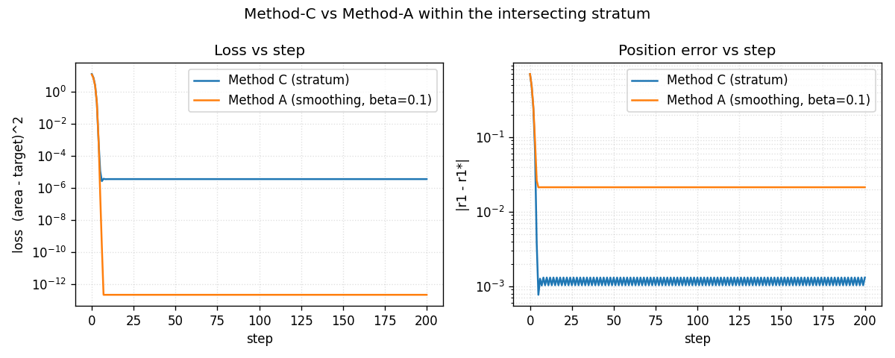

# Method-C applied convergence demo

Two disks, ``C1 = (0, 0)``, ``R1`` optimised toward the analytical ground truth ``r1* = 1.5``, ``C2 = (1, 0)``, ``R2 = 1``.  The objective is ``loss(r1) = (union_area(a, b) - target)^2`` with the target computed in closed form by ``brepax.analytical.disk_disk.disk_disk_union_area``.  The same gradient-descent loop runs twice, once with ``method="stratum"`` (Method C) and once with ``method="smoothing", k=0.1, beta=0.1, resolution=128`` (Method A).  The numbers below are the output of one command.

Settings: ``lr=0.01``, ``max_steps=200``, ``init_r1=0.8``, ``target_area=7.880057`` (closed form).

## Final-step numbers

| Method | final r1 | |r1 - r1*| | final loss | steps |
|---|---|---|---|---|
| Method C (stratum) | 1.501310 | 1.31e-03 | 3.62e-06 | 200 |
| Method A (smoothing, beta=0.1) | 1.478751 | 2.12e-02 | 2.27e-13 | 200 |

Method C converges to the grid-discretisation floor of its stratum-aware integrator.  Method A's residual is the bias introduced by the sigmoid temperature ``beta``; it does not shrink with more gradient-descent steps because the bias is inherent to the smoothed objective, not a transient of the optimiser.  This is the documented behaviour from ``tests/benchmarks/test_optimization_trajectory.py``; the purpose of this page is to make it visible alongside the rest of the documentation rather than to claim it as a new result.

## Convergence plot

---

Regenerate with `uv run python -m benchmarks.method_c_demo.run`.
